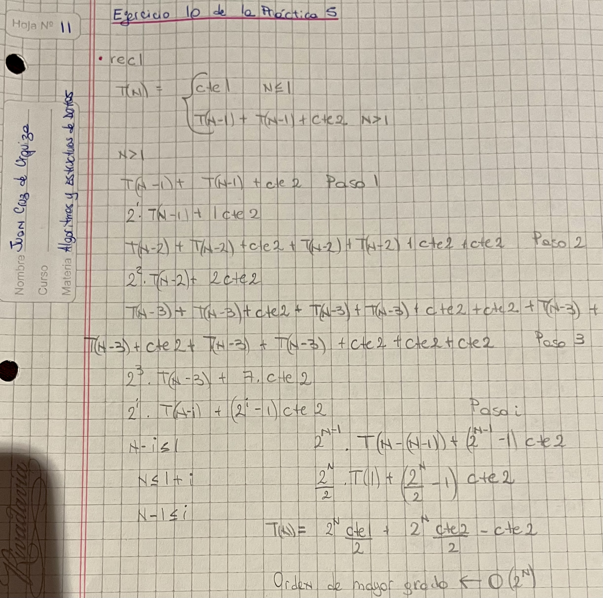

# AyED

# Ejercitaciones

Preguntas y respuestas que no necesitan de código.

---

## Práctica 2

- **1.4:** ¿Qué diferencia encuentra entre las implementaciones de los puntos anteriores?
    
    No hay gran diferencia entre las implementaciones, ya que ambas se resuelven de la misma forma, la única diferencia visible es el tipo de Lista que se instancia, mientras que en el 1.2 se instancia una ListaDeEnterosConArreglos, en el 1.3 se instancia una ListaDeEnterosEnlazada. 
    
- **1.7:** Analice las implementaciones de la clase ListaDeEnteros y sus subclases.
    - **a)** ¿Podría darle comportamiento a algún método de la superclase ListaDeEnteros? ¿Por qué la clase se define como abstracta? Note que una subclase implementa la lista usando un arreglo de tamaño fijo y la otra usando nodos enlazados.
        
        No, no se podría dar comportamiento a los métodos de la superclase ListaDeEnteros ya que todos los métodos son abstractos, y no pueden tener comportamiento. La clase se define como abstracta porque no se puede instanciar, sólo se pueden instanciar las listas con un arreglo de tamaño fijo y con nodos enlazados,
        
    - **b)** Considerando los enlaces entre nodos, ¿qué diferencias existen entre agregar un nodo al principio de la lista, agregar un nodo en el medio y agregar un nodo al final?
        
        Cuando se agregan nodos en diferentes posiciones de las listas, se tienen que redireccionar los punteros para que la lista siga quedando de forma ordenada.
        
    - **c)** Una lista implementada con arreglos, ¿tiene su primer elemento en el índice del vector: 0, 1 o depende de la implementación?
        
        Una lista implementada con arreglos tiene su primer elemento en el índice del vector 1.
        
- **2.1:** ¿Podría resolver los ejercicios del punto 1 utilizando listas genéricas?
    
    Sí, se podría resolver ya que estas listas pueden almacenar cualquier tipo de datos, por lo que podrán almacenar enteros.
    
- **2.4:** Analice las implementaciones de la clase ListaGenerica<T> y sus subclases, luego responda.
    - **a)** ¿Qué diferencia observa entre las implementaciones de ListaEnlazadaGenerica y ListaDeEnterosEnlazada?
        
        La mayor diferencia entre estas 2 implementaciones es que la ListaEnlazadaGenerica puede almacenar cualquier tipo de datos, mientras que la ListaDeEnterosEnlazada sólamente puede almacenar números enteros.
        
    - **b)** ¿Cómo se define el nodo genérico? ¿Cómo se crea una instancia del mismo?
        
        Un nodo genérico es una clase de Java que almacena un dato llamado T que puede ser de cualquier tipo, devolverlo mediante un método get, colocarlo mediante un método set, y lo mismo con el siguiente nodo. Se crean instancias de nodos genéricos cuando se instancia una ListaEnlazadaGenerica.
        
    - **c)** ¿Qué devuelve el método elemento() de la lista?
        
        El método elemento() retorna el elemento de la posición indicada.
        
    - **d)** ¿Cómo agregaría un método nuevo? Implemente un nuevo método de la lista que se llame agregar(T[]):boolean. El mismo debe agregar todos los elementos del arreglo que recibe como parámetro y retornar true si todos ellos fueron agregados.
        
        Lo agregaría en la clase padre como un método abstracto, así puede ser heredado por la ListaEnlazadaGenerica.
        
    
- **4:** Considere un string de caracteres S, el cual comprende únicamente los caracteres: (,),[,],{,}. Decimos que S está balanceado si tiene alguna de las siguientes formas:
S = "" S es el string de longitud cero. S = "(T)". S = "[T]". S = "{T}". S = "TU".
Donde ambos T y U son strings balanceados. Por ejemplo, "{( ) [ ( ) ] }" está balanceado, pero "( [ ) ]" no lo está.
    - **a)** Indique que estructura de datos utilizará para resolver este problema y como la utilizará.
        
        Para resolver este problema, la estructura de datos a utilizar es una pila, que vaya apilando cuando el carácter es un carácter de apertura, y desapile si es un carácter de cierre. Si tiene que desapilar y la pila está vacía, es porque se leyó un carácter de cierre sin que haya uno de apertura, por lo que la cadena está desbalanceada. Si al final del recorrido la pila está vacía (asumiendo que se haya apilado y desapilado) es porque la cadena está balanceada.
        

---

## Práctica 3

- **4:** Una red binaria es una red que posee una topología de árbol binario lleno. Los nodos que conforman una red binaria llena tiene la particularidad de que todos ellos conocen cuál es su retardo de reenvío. El retardo de reenvío se define como el período comprendido entre que un nodo recibe un mensaje y lo reenvía a sus dos hijos. Su tarea es calcular el mayor retardo posible, en el camino que realiza un mensaje desde la raíz hasta llegar a las hojas en una red binaria llena. Nota: asuma que cada nodo tiene el dato de retardo de reenvío expresado en cantidad de segundos.
    - **a)** Indique qué estrategia (recorrido en profundidad o por niveles) utilizará para resolver el problema.
        
        Para resolver este problema, se hará un recorrido en profundidad, ya que se debe recorrer toda la red binaria.
        

---

## Práctica 4

- **2a:** ¿Qué recorridos conoce para recorrer en profundidad un árbol general? Explique brevemente.
    
    Hay diferentes tipos de recorridos para los árboles generales.
    
    Preorden: Se procesa primero la raíz y luego los hijos.
    
    Inorden: Se procesa el primer hijo, luego la raíz y por último los hijos restantes.
    
    Postorden: Se procesan primero los hijos y luego la raíz.
    
- **2b:** ¿Qué recorridos conoce para recorrer por niveles un árbol general? Explique brevemente.
    
    En el recorrido por niveles, se procesan los nodos teniendo en cuenta sus niveles, primero la raíz, luego todos los hijos de la raíz, luego todos los hijos del primer hijo de la raíz,etc.
    
- **2c:** ¿Existe alguna diferencia entre los recorridos preorden, postorden, inorden para recorrer los
árboles generales respecto de los árboles binarios? Justifique su respuesta.
    
    La diferencia entre estos algoritmos para recorrer los árboles, es que en los árboles generales se van a tener que procesar más hijos, ya que no hay una cantidad máxima de hijos como lo hay en los árboles binarios, en donde cada nodo solo puede tener 2 o menos hijos.
    
- **2d:** ¿Existe alguna noción de orden entre los elementos de un árbol general? Justifique su respuesta.
    
    No, no existe alguna noción de orden entre los elementos de un árbol general, debido a que un nodo puede tener varios hijos que no tengan un orden predefinido, y éstos van a ser recorridos en diferente orden según el algoritmo de recorrido utilizado.
    
- **2e:** En un árbol general se define el grado de un nodo como el número de hijos de ese nodo y el grado del árbol como el máximo de los grados de los nodos del árbol. ¿Qué relación encuentra entre los Árboles Binarios sin tener en cuenta la implementación? Justifique su respuesta.
    
    En los árboles binarios, el grado de un nodo también está dado por el número de hijos que posee ese mismo nodo, la diferencia es que en los árboles binarios los nodos sólo podrán tener grado 0,1 ó 2, mientras que en los árboles generales el grado del árbol en sí está dado por el grado mayor entre todos sus nodos, que puede ser mayor a 2 porque no hay una cantidad de hijos máxima que se puedan agregar.
    
- **3b:** Si ahora tuviera que implementar estos métodos en la clase ArbolGeneral <T>, ¿qué
modificaciones haría tanto en la firma como en la implementación de los mismos?
    
    En la firma de los métodos, se tendría que cambiar los parámetros, ya que al estar implementados en la misma clase del árbol, no se tiene que pasar el mismo árbol como parámetro, se puede acceder a éste usando la palabra clave **this**. En la implementación de los métodos sería algo parecido, podría usar this.getDato() para acceder a los datos de los nodos en vez de utilizar a.getDato().
    
- **5:** El esquema de comunicación de una empresa está organizado en una estructura jerárquica, en donde cada nodo envía el mensaje a sus descendientes. Cada nodo posee el tiempo que tarda en transmitir el mensaje. Se debe devolver el mayor promedio entre todos los valores promedios de los niveles
    - **a:** Indique y justifique qué tipo de recorrido utilizará para resolver el problema.
        
        Para resolver este problema se necesita hacer un recorrido por niveles, ya que se necesita recolectar los valores promedios de todos los niveles.
        

---

## Ejercitación de Árboles Binarios, de Expresión y Generales

- **1:** Dado un árbol binario T cuyo recorrido postorden es A G F E B J I H C D y su recorrido inorden es A B G E F D J H I C ¿Cuántos son los descendientes del nodo “C”?
    
    La respuesta correcta es 3 descendientes, opción c).
    
- **2:** Defina árbol binario completo y árbol binario lleno. Ejemplifique. ¿Es verdad que todo árbol
binario completo es lleno? ¿Y viceversa?
    
    Un árbol binario lleno es un árbol de altura h y grado 2, en el cual todos los nodos comprendidos hasta el nivel h-1 tienen 2 hijos, y las hojas se encuentran en el nivel h.
    
    Un árbol binario completo es un árbol binario de altura h, que está lleno hasta la altura h-1, y las hojas que se encuentran en el nivel h se van completando de izquierda a derecha.
    
    Un árbol binario completo no es un árbol lleno, pero un árbol lleno sí puede ser un árbol completo, si es que las hojas en el nivel h fueron cargadas de izquierda a derecha.
    
    Ejemplo: 
    
    
    
- **3:** Suponga que para un árbol binario T con N nodos (N>1), el último nodo en postorden es el
mismo que el último nodo en inorden, ¿Qué se puede concluir?
    
    Si el último nodo en postorden es el mismo que el último nodo en inorden, se puede concluir que el subárbol derecho de T es vacío, opción b). Esto es porque, en inorden se recorre primero el hijo izquierdo, luego la raíz y por último el hijo derecho. Si no tiene hijo derecho, lo último que imprime es la raíz. En el recorrido postorden, lo último que se procesa es la raíz, por lo que si no tiene hijo derecho, lo último que se imprime es la raíz del árbol T, coincidiendo con el recorrido inorden.
    
- **4:** Se han estudiado los distintos recorridos de un árbol binario. Abajo se muestra un código que combina dos de ellos. ¿Cuál es el resultado si se llama con la raíz del árbol de la figura?:
    
    ```java
    public void traverse(ArbolBinario<T> a) {
    	if (!a.esVacio()) {
    		System.out.print(a.getDato());
    		if (a.tieneHijoIzquierdo())
    			traverse(a.getHijoIzquierdo());
    		if (a.tieneHijoDerecho())
    			traverse(a.getHijoDerecho());
    		System.out.print(a.getDato());
    	}
    }
    ```
    
    
    
    El resultado de este código en el árbol de la figura sería: CABBAEDDFFEC
    
- **5:** Evalúe la siguiente expresión postfija 6 5 * 7 3 − 4 8 + * + y determine cuál es el resultado.
    
    El resultado de esa expresión postfija es 78, opción a).
    
- **6:** Elija la expresión algebraica almacenada en el siguiente árbol:
    
    
    
    
    La expresión algebraica correcta para ese árbol es: ((a-b)/c)+(d*e)), opción d).
    
- **7:** ¿Cuál es el número mínimo de nodos en un árbol binario completo de altura 4?
    
    El número mínimo de nodos en un árbol binario completo de altura 4 es 16, opción e).
    
- **8:** Construya el árbol de expresión correspondiente a la siguiente expresión postfija: 6 5 * 7 3 − 4 8 * + +
    
    
    
- **9:** Construya el árbol de expresión correspondiente a la siguiente expresión infija: ( A + ( B * C )) * ( D – E )
    
    
    
- **10:** Construya el árbol de expresión correspondiente a la siguiente expresión prefija: + + a e / * - b c d f
    
    
    
    ¿Cuál es la profundidad del nodo d?
    
    La profundidad del nodo d es 3, opción c).
    
- **11:** Obtenga la expresión prefija de la siguiente expresión postfija: A B C * D - E F / G / - *
    
    La expresión prefija de la expresión postfija es: * A - - * B C D / / E F G
    
- **12:** ¿Cuál de los siguientes árboles binarios tiene su recorrido inorden BCAD y preorden ABCD?
    
    
    
    El árbol binario que tiene un recorrido inorden BCAD y un preorden ABCD es el árbol de la opción d).
    
- **13:** Reconstruya el árbol binario T cuyo recorrido preorden es 2 5 3 9 7 1 6 4 8 y su recorrido
inorden es 9 3 7 5 1 2 6 8 4.
    
    
    
- **14:** La siguiente figura muestra un árbol general:
    
    
    
    - **a)** Complete los bancos de las sentencias con la terminología vista en clase:
        
        A es la raíz del árbol.
        
        A es padre de B,C, y D.
        
        E y F son hermanos, puesto que ambos son hijos de B.
        
        E, J, K, L, C, P, Q, H, N y O y son las hojas del árbol.
        
        El camino desde A a J es único, lo conforman los nodos A, B, F J y es de largo 3.
        
        G es ancestro de P, por lo tanto P es descendiente de D.
        
        L no es descendiente de C, puesto que no existe un camino desde C a L.
        
        La profundidad/nivel de C es 1, de F es 2 y P de es 4.
        
        La altura de C es 0, de F es 1 y de D es 3.
        
        La altura del árbol es 4 (largo del camino entre la A y P ).
        
    - **b)** Aplique los recorridos:
        
        Preorden: ABEFJKLCDGMPQHINO
        
        Inorden: EBJFKLACPMQGDHNIO
        
        Postorden: EJKLFBCPQMGHNOIDA
        
        Por niveles: ABCDEFGHIJKLMNOPQ
        
    
- **15:** ¿Cuál es el número mínimo y máximo de nodos de un árbol general completo de altura h y
grado k?
    
    El número mínimo de nodos de un árbol general completo de altura h y grado k es (k^h + k - 2) / (k-1).
    
    El número máximo de nodos de un árbol general completo de altura h y grado k es la sumatoria de k elevado desde 0 hasta h, es decir (k^(h+1)-1)/(k-1).
    
- **16:** El recorrido inorden en un árbol general visita:
    
    Primero el subárbol hijo más izquierdo, luego la raíz y luego los restantes subárboles hijos, opción d).
    
- **17:** En un árbol general, la profundidad de un nodo n1 es:
    
    La longitud del único camino que existe entre la raíz y el nodo n1, opción a).
    
- **18:** Un árbol general lleno de grado 4, tiene 21 nodos. ¿Cuál es la altura del árbol? Desarrolle el proceso realizado para obtener la respuesta anterior.
    
    La altura del árbol es 2. Esto es porque la sumatoria de 4^0 hasta k^2 = 1 + 4 + 16 = 21. Se puede plantear la ecuación (4^(h+1)-1)/(4-1) = 21, la cual despejando para h y aplicando logaritmos, se llega a que h=2. Si se reemplaza 2 por h en la ecuación, la respuesta también será 21.
    
- **19:** ¿Cuál es la cantidad mínima de nodos en un árbol general completo de grado 3 y altura 4?
    
    La cantidad mínima de nodos de un árbol general completo de grado 3 y altura 4 es la sumatoria del grado elevado a la 0 hasta 3 + 1 (el único nodo en el nivel 4) ya que es el mínimo de nodos para que sea un árbol completo. 3^0 + 3^1 + 3^2 + 3^3 + 1 = 1 + 3 + 9 +27 +1 = 41, opción b).
    
- **20:** Si un árbol general lleno de grado 5 tiene 125 hojas, ¿Cuál es la cantidad de nodos internos del árbol? Desarrolle el proceso realizado para obtener la respuesta anterior.
    
    Si un árbol general lleno de grado tiene 125 hojas, hay que calcular su altura, lo cual se puede hacer haciendo log en base 5 de 125, lo que nos da 3. Esto significa que los nodos internos están comprendidos desde el nivel 0 (raíz) hasta el nivel 2 (padres de hojas). Haciendo 5^0 + 5^1 + 5^2 = 1 + 5 + 25 obtenemos 31, la cantidad de nodos internos del árbol.
    

---

## Ejercitación sobre Colas de Prioridad - Heap

- **1:** A partir de una heap inicialmente vacía, inserte de a uno los siguientes valores: 6, 4, 15, 2, 10, 11, 8, 1, 13, 7, 9, 12, 5, 3, 14
    
    Creación de MinHeap:
    
    
    
    Se inserta el 6.
    
    
    
    Se inserta y filtra el 4.
    
    
    
    Se inserta el 15.
    
    
    
    Se inserta y filtra el 2.
    
    
    
    Se inserta el 10.
    
    
    
    Se inserta y filtra el 11.
    
    
    
    Se inserta y filtra el 8.
    
    
    
    Se inserta y filtra el 1.
    
    
    
    Se inserta el 13.
    
    
    
    Se inserta y filtra el 7.
    
    
    
    Se inserta el 9.
    
    
    
    Se inserta y filtra el 12.
    
    
    
    Se inserta y filtra el 5.
    
    
    
    Se inserta y filtra el 3.
    
    
    
    Se inserta el 14.
    
- **2a:** ¿Cuántos elementos hay, al menos, en una heap de altura h?
    
    Una heap de altura h significa que los nodos internos están comprendidos desde 2^0 hasta 2^h-1, y por lo menos hay un nodo hoja en la altura h si es que el árbol no está lleno. La cuenta para calcular la cantidad de elementos es 2^h
    
- **2b:** ¿Dónde se encuentra ubicado el elemento mínimo en una max-heap?
    
    El elemento mínimo en una max heap se encuntra ubicado en alguna hoja, pero no se puede saber cuál exactamente.
    
- **2c:** ¿El siguiente arreglo es una max-heap : [23, 17, 14, 6, 13, 10, 1, 5, 7, 12]?
    
    No, no es una maxheap porque no se respeta que los nodos sean menores que los hijos. 6 es padre de 7, el cual es mayor.
    
- **3:** Dados los siguientes árboles, indique si representan una heap. Justifique su respuesta.
    
    
    
    
    No, este árbol no representa una heap: en el nivel h, los nodos no se están completando de izquierda a derecha, por lo que no cumple con la propiedad de ser un árbol completo y, por lo tanto, no es una heap.
    
    
    
    No, este árbol tampoco representa una heap: en una MinHeap los hijos deben ser menores que el padre, y en una MaxHeap los hijos deben ser mayores que el padre. En este árbol no se cumple ninguna de esas propiedades porque, por ejemplo, el nodo 4 tiene de hijo al valor 2 (menor) y al valor 7 (mayor), por lo tanto no es una heap.
    
- **4:** Dibuje todas las min-heaps posibles para este conjunto de claves: {A, B, C, D, E}.
    
    
    
- **5:** A partir de una min-heap inicialmente vacía, dibuje la evolución del estado de la heap al ejecutar las siguientes operaciones: Insert(5), Insert(4), Insert(7), Insert(1), DeleteMin(), Insert(3), Insert(6), DeleteMin(), DeleteMin(), Insert(8), DeleteMin(), Insert(2), DeleteMin(), DeleteMin()
    
    
    
    
    Insert(5)
    
    
    
    Insert(4)
    
    
    
    Insert(7)
    
    
    
    Insert(1)
    
    
    
    DeleteMin()
    
    
    
    Insert(3)
    
    
    
    Insert(6)
    
    
    
    DeleteMin()
    
    
    
    DeleteMin()
    
    
    
    Insert(8)
    
    
    
    DeleteMin()
    
    
    
    Insert(2)
    
    
    
    DeleteMin()
    
    
    
    DeleteMin()
    
- **6:** Aplique el algoritmo BuildHeap, para construir una min-heap en tiempo lineal, con los siguientes valores {150, 80, 40, 10, 70, 110, 30, 120, 140, 60, 50, 130, 100, 20, 90}
    
    
    
- **7:** Aplique el algoritmo HeapSort, para ordenar descendentemente los siguientes elementos {15, 18, 40, 1, 7, 10, 33, 2, 140, 500, 11, 12, 13, 90}. Muestre paso a paso la ejecución del algoritmo sobre los datos.
    
    
    
    
    Se crea una MinHeap con los elementos.
    
    El arreglo actual es: {1,2,7,10,11,12,13,15,18,33,40,90,140,500}
    
    
    
    Se intercambia el primero con el último y se decrementa el tamaño.
    
    El arreglo actual es: {500,2,7,10,11,12,13,15,18,
    
    33,40,90,140} |1
    
    
    
    Se filtra el 500.
    
    El arreglo actual es: {2,10,7,15,11,12,13,500,18,
    
    33,40,90,140} |1
    
    
    
    Se intercambia el primero con el último y se decrementa el tamaño.
    
    El arreglo actual es: {140,10,7,15,11,12,13,500,18,33,40,90,140} |2,1
    
    
    
    Se filtra el 140.
    
    El arreglo actual es: {7,10,12,15,11,90,13,500,18,33,40,140} | 2,1
    
    
    
    Se intercambia el primero con el último y se decrementa el tamaño.
    
    El arreglo actual es: {140,10,12,15,11,90,13,500,18,33,40} | 7,2,1
    
    
    
    Se filtra el 140.
    
    El arreglo actual es: {10,11,12,15,33,90,13,500,
    
    18,140,40} |7,2,1
    
    
    
    Se intercambia el primero con el último y se decrementa el tamaño.
    
    El arreglo actual es: {40,11,12,15,33,90,13,500,
    
    18,140,40} |10,7,2,1
    
    
    
    Se filtra el 40.
    
    El arreglo actual es: {11,15,12,18,33,90,13,500,
    
    40,140} | 10,7,2,1
    
    
    
    Se intercambia el primero con el último y se decrementa el tamaño.
    
    El arreglo actual es: {140,15,12,18,33,90,13,500,
    
    40} | 11,10,7,2,1
    
    
    
    Se filtra el 140.
    
    El arreglo actual es: {12,15,13,18,33,90,140,500,40} | 11,10,7,2,1
    
    
    
    Se intercambia el primero con el último y se decrementa el tamaño.
    
    El arreglo actual es:{40,15,13,18,33,90,140,500} | 12,11,10,7,2,1
    
    
    
    Se filtra el 40.
    
    El arreglo actual es:{13,15,40,18,33,90,140,500} | 12,11,10,7,2,1
    
    
    
    Se intercambia el primero con el último y se decrementa el tamaño.
    
    El arreglo actual es:{500,15,40,18,33,90,140} 
    
    | 13,12,11,10,7,2,1
    
    
    
    Se filtra el 500.
    
    El arreglo actual es:{15,18,40,500,33,90,140} 
    
    | 13,12,11,10,7,2,1
    
    
    
    Se intercambia el primero con el último y se decrementa el tamaño.
    
    El arreglo actual es:{140,18,40,500,33,90} 
    
    | 15,13,12,11,10,7,2,1
    
    
    
    Se filtra el 140.
    
    El arreglo actual es:{18,33,40,500,140,90} 
    
    | 15,13,12,11,10,7,2,1
    
    
    
    Se intercambia el primero con el último y se decrementa el tamaño.
    
    El arreglo actual es:{90,33,40,500,140} 
    
    | 18,15,13,12,11,10,7,2,1
    
    
    
    Se filtra el 90.
    
    El arreglo actual es: {33,90,40,500,140} 
    
    | 18,15,13,12,11,10,7,2,1
    
    
    
    Se intercambia el primero con el último y se decrementa el tamaño.
    
    El arreglo actual es: {140,90,40,500} 
    
    | 33,18,15,13,12,11,10,7,2,1
    
    
    
    Se filtra el 140.
    
    El arreglo actual es: {40,90,140,500} 
    
    | 33,18,15,13,12,11,10,7,2,1
    
    
    
    Se intercambia el primero con el último y se decrementa el tamaño.
    
    El arreglo actual es: {500,90,140} | 40, 33,18,15,13,12,11,10,7,2,1
    
    
    
    Se filtra el 500.
    
    El arreglo actual es: {90,500,140} | 40, 33,18,15,13,12,11,10,7,2,1
    
    
    
    Se intercambia el primero con el último y se decrementa el tamaño.
    
    El arreglo actual es: {140,500} | 90, 40, 33,18,15,13,12,11,10,7,2,1
    
    
    
    Se intercambia el primero con el último y se decrementa el tamaño.
    
    El arreglo actual es: {500} 
    
    | 140, 90, 40, 33,18,15,13,12,11,10,7,2,1
    
    El arreglo tiene longitud 1: se agrega el último nodo de la Heap al arreglo.
    
    El arreglo queda: {500,140, 90, 40, 33,18,15,13,12,11,10,7,2,1}
    
- **8:** Construir una max-heap binaria con los siguientes datos: {5, 8, 12, 9, 7, 10, 21, 6, 14, 4}
    - **a)** Insertándolos de a uno.
        
        
        
        
        Se inserta el 5.
        
        
        
        Se inserta y filtra el 8.
        
        
        
        Se inserta y filtra el 12.
        
        
        
        Se inserta y filtra el 9.
        
        
        
        Se inserta el 7.
        
        
        
        Se inserta y filtra el 10.
        
        
        
        Se inserta y filtra el 21.
        
        
        
        Se inserta y filtra el 6.
        
        
        
        Se inserta y filtra el 14.
        
        
        
        Se inserta el 4.
        
    - **b)** Usando el algoritmo BuildHeap.
        
        
        
        
        Se crea un árbol binario con los elementos del arreglo.
        
        
        
        Se empieza a filtrar desde tamaño / 2. Como en este caso el 7 estaba en la posición correcta, se pasa a la anterior posición del arreglo (se tiene que decrementar tamaño / 2)  y se filtra.
        
        
        
        Se filtra la posición anterior del arreglo, el 12.
        
        
        
        Se filtra la posición anterior del arreglo, el 8.
        
        
        
        Se filtra la posición anterior del arreglo, el 21.
        
    
- **9:** Suponga que una heap que representa una cola de prioridades está almacenada en el arreglo A (se comienza de la posición A[1]). Si insertamos la clave 16, ¿en qué posición quedará?
    
    
    
    Si se inserta la clave 16, quedará en la posición A[3], opción b).
    
- **10:** Suponga que una heap que representa una cola de prioridades está almacenada en el arreglo A (se comienza de la posición A[1]). Si aplica un delete-min, ¿en qué posición quedará la clave 62?
    
    
    
    Si se realiza un delete-min, la clave 62 quedará en la posición A[10], opción c).
    
- **11a:** Ordenar en forma creciente los datos del ejercicio anterior, usando el algoritmo HeapSort.
    
    
    
    
    Se crea una MaxHeap con los elementos.
    
    El arreglo actual es: {62,51,42,44,43,32,34,37,36,27,21,11}
    
    
    
    Se intercambia el primero con el último y se decrementa el tamaño.
    
    El arreglo actual es: {11,51,42,44,43,32,34,37,36,27,21} | 62
    
    
    
    Se filtra el 11.
    
    El arreglo actual es: {51,44,42,37,43,32,34,11,36,27,21} | 62
    
    
    
    Se intercambia el primero con el último y se decrementa el tamaño.
    
    El arreglo actual es: {21,44,42,37,43,32,34,11,36,27} | 51,62
    
    
    
    Se filtra el 21.
    
    El arreglo actual es: {44,43,42,37,27,32,34,11,36,21} | 51,62
    
    
    
    Se intercambia el primero con el último y se decrementa el tamaño.
    
    El arreglo actual es: {21,43,42,37,27,32,34,11,
    
    36} | 44,51,62
    
    
    
    Se filtra el 21.
    
    El arreglo actual es: {43,37,42,36,27,32,34,11,
    
    21} | 44,51,62
    
    
    
    Se intercambia el primero con el último y se decrementa el tamaño.
    
    El arreglo actual es: {21,37,42,36,27,32,34,11} 
    
    | 43,44,51,62
    
    
    
    Se filtra el 21.
    
    El arreglo actual es: {42,37,34,36,27,32,21,11}
    
    |43,44,51,62
    
    
    
    Se intercambia el primero con el último y se decrementa el tamaño.
    
    El arreglo actual es: {11,37,34,36,27,32,21}
    
    |42,43,44,51,62
    
    
    
    Se filtra el 11.
    
    El arreglo actual es: {37,36,34,11,27,32,21}
    
    |42,43,44,51,62
    
    
    
    Se intercambia el primero con el último y se decrementa el tamaño.
    
    El arreglo actual es: {21,36,34,11,27,32}
    
    |37,42,43,44,51,62
    
    
    
    Se filtra el 21.
    
    El arreglo actual es: {36,27,34,11,21,32}
    
    |37,42,43,44,51,62
    
    
    
    Se intercambia el primero con el último y se decrementa el tamaño.
    
    El arreglo actual es: {32,27,34,11,21}
    
    |36,37,42,43,44,51,62
    
    
    
    Se filtra el 32.
    
    El arreglo actual es: {34,27,32,11,21}
    
    |36,37,42,43,44,51,62
    
    
    
    Se intercambia el primero con el último y se decrementa el tamaño.
    
    El arreglo actual es: {21,27,32,11}
    
    |34,36,37,42,43,44,51,62
    
    
    
    Se filtra el 21.
    
    El arreglo actual es: {32,27,21,11}
    
    |34,36,37,42,43,44,51,62
    
    
    
    Se intercambia el primero con el último y se decrementa el tamaño.
    
    El arreglo actual es: {11,27,21}
    
    |32,34,36,37,42,43,44,51,62
    
    
    
    Se filtra el 11.
    
    El arreglo actual es: {27,11,21}
    
    |32,34,36,37,42,43,44,51,62
    
    
    
    Se intercambia el primero con el último y se decrementa el tamaño.
    
    El arreglo actual es: {21,11}
    
    |27,32,34,36,37,42,43,44,51,62
    
    
    
    Se intercambia el primero con el último y se decrementa el tamaño.
    
    El arreglo actual es: {11}
    
    |21,27,32,34,36,37,42,43,44,51,62
    
    El arreglo tiene longitud 1: se agrega el último nodo de la Heap al arreglo.
    
    El arreglo queda: {11,21,27,32,34,36,37,42,43,44,51,62}
    
- **11b:** ¿Cuáles serían los pasos a seguir si se quiere ordenar en forma decreciente?
    
    Si se quiere ordenar en forma decreciente, entonces con el arreglo se debe crear una MinHeap en vez de una MaxHeap, y seguir los pasos de la HeapSort.
    
- **12:** ¿Cuáles de los siguientes arreglos representan una max-heap, min-heap o ninguna de las dos?
    - Arreglo 1: 0 1 2 0 4 5 6 7 8 9
    - Arreglo 2: 9 8 7 6 5 4 3 2 1 0
    - Arreglo 3: 5 5 5 6 6 6 6 7 7 1
    - Arreglo 4: 9 3 9 2 1 6 7 1 2 1
    - Arreglo 5: 8 7 6 1 2 3 4 2 1 2
    
    De los siguientes arreglos, el Arreglo 2 y el Arreglo 4 representan una MaxHeap, el resto de arreglos no representan ninguna heap.
    
- **13:** Un arreglo de 7 enteros se ordena ascendentemente usando el algoritmo HeapSort. Luego de la fase inicial del algoritmo (la construcción de la heap), ¿cuál de los siguientes es un posible orden del arreglo?
    
    a) 85 78 45 51 53 47 49
    
    b) 85 49 78 45 47 51 53
    
    c) 85 78 49 45 47 51 53
    
    d) 45 85 78 53 51 49 47
    
    e) 85 51 78 53 49 47 45
    
    El único posible orden del arreglo creado para usar el HeapSort, es la opción b).
    
- **14:** En una Heap, ¿para un elemento que está en la posición i su hijo derecho está en la posición……?
    
    El hijo derecho de un elemento en la posición i está en la posición 2*i+1, opción c).
    
- **15:** ¿Siempre se puede decir que un árbol binario lleno es una Heap?
    
    No, no siempre un árbol binario es una Heap ya que es posible que no se cumplen la propiedad estructural o la propiedad de orden, opción a).
    
- **16:** La operación que agrega un elemento a la heap que tiene n elementos, en el peor caso es de:
    
    En el peor casos es de O (log n), opción c).
    
- **17:** Se construyó una Máx-Heap con las siguientes claves: 13, 21, 87, 30, 25, 22, 18. ¿Cuál de las siguientes opciones corresponde al resultado de realizar la construcción insertando las claves una a una?
    
    a) 87, 30, 25, 22, 21, 18, 13
    
    b) 87, 30, 22, 21, 25, 13, 18
    
    c) 87, 30, 25, 13, 22, 18, 21
    
    d) 87, 30, 22, 13, 25, 21, 18
    
    Al construir una MaxHeap con esas claves, el arreglo queda como la opción d).
    
- **18:** Se construyó una Máx-Heap con las siguientes claves: 13, 21, 87, 30, 25, 22, 18. ¿Cuál de las siguientes opciones corresponde al resultado de realizar la construcción aplicando el algoritmo Build-Heap?
    
    a) 87, 30, 25, 22, 21, 18, 13
    
    b) 87, 30, 22, 21, 25, 13, 18
    
    c) 87, 30, 25, 13, 22, 18, 21
    
    d) 87, 30, 22, 13, 25, 21, 18
    
    Al construir una MaxHeap con esas claves, el arreglo queda como la opción b).
    
- **19:** El algoritmo HeapSort consta de dos etapas:
    1. Se construye una heap y
    2. Se realizan los intercambios necesarios para dejar ordenados los datos.
    Asuma que la heap ya está construida y es lasiguiente: 58 38 53 23 28 40 35 18
    ¿Cómo quedan los datos en el arreglo después de ejecutar sólo 2 pasos de la segunda etapa del Heapsort?
    
    a) 40 38 23 28 35 18 53 58
    
    b) 53 38 40 23 28 18 35 58
    
    c) 40 38 23 35 28 18 53 58
    
    d) 40 38 35 23 28 18 53 58
    
    Después de ejecutar sólo 2 pasos del Heapsort, el arreglo queda como la opción d).
    
- **20:** Dada la Min-Heap 3, 8, 5, 15, 10, 7, 19, 28, 16, 25, 12. ¿En qué posición está ubicado el hijo derecho de la clave 15?
    
    a) 7
    
    b) 8
    
    c) 9
    
    d) 10
    
    El hijo derecho de la clave 15 es el valor 16, que está ubicado en la posición 9, opción c).
    
- **21:** Construya una min-heap con las siguientes claves: 15, 25, 23, 13, 18, 2, 19, 20, 17 insertándolas una a una. Indique en qué posiciones quedaron ubicadas las claves: 2, 18 y 25.
    
    Al construir una MinHeap con esas claves siendo insertadas de a una, la clave 2 queda ubicada en la posición 1, la clave 18 queda ubicada en la posición 5 y la clave 25 queda ubicada en la posición 8.
    
- **22:** Luego de insertar la clave 15 en la siguiente min-heap, ¿cuántas de las claves que ya estaban en la heap han mantenido su lugar (es decir, ocupan en la min-heap resultante la misma posición que ocupaban antes de la inserción)?
    
    
    
    
    a) Ninguna
    
    b) Seis
    
    c) Ocho
    
    d) Nueve
    
    Al insertar la clave 15, ocho claves mantuvieron su lugar, opción c).
    
- **23:** Luego de una operación de borrado del mínimo en la siguiente min-heap, ¿cuántas claves han cambiado de lugar (es decir, ocupan en la min-heap resultante un lugar diferente al que ocupaban en la min-heap antes del borrado)? (No contar la clave borrada, ya que no pertenece más a la heap)
    
    
    
    
    a) Ninguno
    
    b) Dos
    
    c) Tres
    
    d) Cuatro
    
    Al realizar la operación de DeleteMin en la MinHeap, las claves que cambiaron de posición fueron 4, opción d).
    

---

## Práctica 5

- **1:** Debido a un error en la actualización de sus sistemas, el banco AyED perdió la información del estado de todas sus cuentas. Afortunadamente logran recuperar un backup del día anterior y utilizando las transacciones registradas en las últimas 24hrs podrán reconstruir los saldos. Hay poco tiempo que perder, el sistema bancario debe volver a operar lo antes posible. Las transacciones se encuentran agrupadas en consultas, una consulta cuenta con un valor y un
rango de cuentas consecutivas a las que hay que aplicar este cambio, por ejemplo la consulta
(333..688 = 120) implica sumar $120 a todas las cuentas entre la número 333 y la número 688
(inclusive). Entonces, la recuperación de los datos consiste en aplicar todas las consultas sobre el estado de las cuentas recuperado en el backup del día anterior. El equipo de desarrollo se pone manos a la obra y llega a una solución rápidamente. Toman cada consulta y recorren el rango de cuentas aplicando el valor correspondiente, como muestra el siguiente algoritmo.
    
    ```java
    Consultas.comenzar()
    While(!consultas.fin()){
    	Consulta = consultas.proximo();
    	for(i = consulta.desde; i < consulta.hasta; i++){
    		cuenta[i] = cuenta[i] + consulta.valor;
    		}
    	}
    ```
    
    Escriben la solución en pocos minutos y ponen en marcha el proceso de recuperación. Enseguida se dan cuenta que el proceso va a tardar muchas horas en finalizar, son muchas cuentas y muchos movimientos, la solución aunque simple es ineficiente. Luego de discutir varias ideas llegan a una solución que logra procesar toda la información en pocos segundos.
    
    - **a)** Para que usted pueda experimentar el tiempo que demora cada uno de los dos algoritmos, lo ponemos a vuestra disposición. Usted debe ejecutar cada uno de los algoritmo, con distinta cantidad de elementos y complete la tabla. Luego haga la gráfica para comparar los tiempos de ambos algoritmos. Tenga encuenta que el algoritmo posee dos constantes CANTIDAD_CUENTAS y CANTIDAD_CONSULTAS, sin embargo, por simplicidad, ambas toman el mismo valor. Solo necesita modificar CANTIDAD_CUENTAS.
        
        
        | Nº Cuentas (y consultas) | procesarMovimientos | procesarMovimientosOptimizado |
        | --- | --- | --- |
        | 1.000 | 0.027 segundos | 0.0 segundos |
        | 10.000 | 0.552 segundos | 0.008 segundos |
        | 25.000 | 4.104 segundos | 0.011 segundos |
        | 50.000 | 20.675 segundos | 0.018 segundos |
        | 100.000 | 87.359 segundos | 0.025 segundos |
        
        
        
        
        
        _y_procesarMovimientosOptimizado_Tiempo_(segundos).png)
        
    - **b)** ¿Por qué procesarMovimientos es tan ineficiente? Tenga en cuenta que pueden existir millones de movimientos diarios que abarquen gran parte de las cuentas bancarias.
        
        procesarMovimientos es tan ineficiente debido a que por cada consulta del array de consultas, recorre todas las cuentas a las que se le debe sumar un valor, resultado en una gran iteración si el número de consultas es muy grande. 
        
    - **c)** ¿En qué se diferencia procesarMovimientosOptimizado? Observe las operaciones que se
    realizan para cada consulta.
        
        La diferencia que tiene procesarMovimientosOptimizado es que hace una estructura auxiliar donde solo hace 2 operaciones al recorrer el array de consultas: en la posicion ‘desde’ suma el valor, y en la posicion ‘hasta’+1 resta el valor. 
        
        Luego, recorre nuevamente el array de las consultas y a cada posición mayor a 0 del array auxiliar le suma el valor del array en la posición actual -1. Luego de eso, actualiza el array de cuentas.
        
        Es más eficiente debido a que se hacen 2 recorridos lineales en los cuales se hacen operaciones de suma y resta, no se tiene que iterar por cada cuenta, lo que reduce el tiempo de ejecución.
        
- **2:** La clase BuscadorEnArrayOrdenado del material adicional resuelve el problema de buscar un
elemento dentro de un array ordenado. El mismo problema, lo resuelve de dos maneras diferentes: búsqueda lineal y búsqueda dicotómica. Se define la variable cantidadElementos, la cual debe ir modificando para determinar una escala (por ejemplo de a 100.000 o 1.000.000, dependiendo de la capacidad de cada equipo), y realice una tabla del tiempo que tarda en ejecutar ambos algoritmos.
    
    
    | N | Lineal | Dicotómica |
    | --- | --- | --- |
    | 100.000 | Tiempo: 2
    Iteraciones: 100.00 | Tiempo: 0
    Iteraciones: 16 |
    | 200.000 | Tiempo: 3
    Iteraciones: 200.000 | Tiempo: 0
    Iteraciones: 17 |
    | 300.000 | Tiempo: 4
    Iteraciones: 300.000 | Tiempo; 0
    Iteraciones: 18 |
    | 400.000 | Tiempo: 4
    Iteraciones: 400.000 | Tiempo: 0
    Iteraciones: 18 |
    | 500.000 | Tiempo: 4
    Iteraciones: 500.000 | Tiempo: 0
    Iteraciones: 18 |
    | 600.000 | Tiempo: 4
    Iteraciones: 600.000 | Tiempo: 0
    Iteraciones: 19 |
- **3:** En la documentación de la clase arrayList que se encuentra en el siguiente link
[https://docs.oracle.com/javase/8/docs/api/java/util/ArrayList.html](https://docs.oracle.com/javase/8/docs/api/java/util/ArrayList.html)
Se encuentran las siguientes afirmaciones:
    - "The size, isEmpty, get, set, iterator, and listIterator operations run in constant time.”
    - “All of the other operations run in linear time (roughly speaking).”
    
    Explique con sus palabras por qué cree que algunas operaciones se ejecutan en tiempo constante y otras en tiempo lineal.
    
    La razón de estas afirmaciones es que, para las operaciones mencionadas que se ejecutan en tiempo constante, no hace falta recorrer la lista, por lo que independientemente de la cantidad de elementos estas operaciones tardarán lo mismo.
    
    El resto de las operciones se ejecutan en tiempo linear (agregar, eliminar, buscar, filtrar, etc) debido a que sí depende la cantidad de elementos que haya en la estructura para poder ser ejecutadas. Por ejemplo, el agregar al final en una lista de 10.000 elementos no tardará lo mismo que el agregar al final en una lista de 5 elementos.
    
- **4:** Determinar si las siguientes sentencias son verdaderas o falsas, justificando la respuesta
utilizando notación Big-Oh.
    - **a)** $3ⁿ$ es de O($2ⁿ$).
        
        Falso. $3ⁿ$  no es de O($2ⁿ$), ya que la función $3ⁿ$  va a crecer más rápido que la función $2ⁿ$  para cualquier número n, y la notación Big O tiene en cuenta la función más grande.
        
    - **b)** $n + log_2(n)$ es de O(n).
        
        Verdadero. El valor que tome n siempre será mayor al valor que tome $log_2(n)$.
        
    - **c)**  $n^{1/2} +10^{20}$ es de O($n^{1/2}$).
        
        Verdadero. $n^{1/2}$ es de O($n^{1/2}$) y $10^{20}$ es una constante que no se tiene en cuenta en la notación Big O.
        
    - **d)** $3n + 17, n<100; 317, n>= 100$ tiene orden lineal.
        
        Verdadero. Si n<100, la función tiene O(n) ya que 17 es una constante que no se tiene en cuenta, y el orden mayor es el de 3n. Si n≥100, la función toma un valor constante, que no debe ser tenido en cuenta, por lo que el orden de mayor grado es O(n).
        
    - **e)** Mostrar que $p(n)=3n^5 + 8n^4 + 2n +1$ es O($n^5$).
        
        Esta función es de O($n^5$) ya que, separando los órdenes de los términos:
        
        $3n^5$ es de O($n^5)$, porque la función resultante, independientemente del valor n, es $f(x)=n^5$.
        
        $8n^4$ es de O($n^4$) porque la función resultante, independientemente del valor n, es $f(x)=n^4$.
        
        $2n$ es de orden lineal, porque la función resultante, independientemente del valor n, es $f(x)=n$.
        
        1 es una constante que no debe tenerse en cuenta.
        
        Los órdenes de los términos entonces son O($n^5$), O($n^4)$ y O(n). Debemos quedarnos con el orden de mayor grado = O($n^5)$.
        
    - **f)** Si $p(n)$ es un polinomio de grado k, entonces $p(n)$ es O($n^k$).
        
        Verdadero. Si es un polinomio de grado k, entonces significa que el mayor grado de la ecuación es k, por lo que el mayor grado será $n^k$, y su orden será ese.
        
- **5:** Se necesita generar una permutación random de los n primeros números enteros. Por ejemplo [4,3,1,0,2] es una permutación legal, pero [0,4,1,2,4] no lo es, porque un número está duplicado (el 4) y otro no está (el 3). Presentamos tres algoritmos para solucionar este problema. Asumimos la existencia de un generador de números random, ran_int (i,j) el cual genera en tiempo constante, enteros entre i y j inclusive con igual probabilidad (esto significa que puede retornar el mismo valor más de una vez). También suponemos el mensaje swap() que intercambia dos datos entre sí.
    
    ```java
    
    public class Ejercicio4 {
    	private static Random rand = new Random();
    
    	public static int[] randomUno(int n) {
    		int i, x = 0, k;
    		int[] a = new int[n];
    		for (i = 0; i < n; i++) {
    			boolean seguirBuscando = true;
    			while (seguirBuscando) {
    				x = ran_int(0, n - 1);
    				seguirBuscando = false;
    				for (k = 0; k < i && !seguirBuscando; k++)
    					if (x == a[k])
    						seguirBuscando = true;
    			}
    			a[i] = x;
    		}
    		return a;
    	}
    
    	public static int[] randomDos(int n) {
    		int i, x;
    		int[] a = new int[n];
    		boolean[] used = new boolean[n];
    		for (i = 0; i < n; i++) 
    			used[i] = false;
    		for (i = 0; i < n; i++) {
    			x = ran_int(0, n - 1);
    			while (used[x]) 
    				x = ran_int(0, n - 1);
    			a[i] = x;
    			used[x] = true;
    		}
    		return a;
    	}
    
    	public static int[] randomTres(int n) {
    		int i;
    		int[] a = new int[n];
    		for (i = 0; i < n; i++) 
    			a[i] = i;
    		for (i = 1; i < n; i++) 
    			swap(a, i, ran_int(0, i - 1));
    		return a;
    	}
    
    	private static void swap(int[] a, int i, int j) {
    		int aux;
    		aux = a[i]; a[i] = a[j]; a[j] = aux;
    	}
    
    	/** Genera en tiempo constante, enteros entre i y j con igual probabilidad.*/
    	private static int ran_int(int a, int b) {
    		if (b < a || a < 0 || b < 0) throw new IllegalArgumentException("Parametros invalidos");
    		return a + (rand.nextInt(b - a + 1));
    	}
    
    	public static void main(String[] args) {
    		System.out.println(Arrays.toString(randomUno(1000)));
    		System.out.println(Arrays.toString(randomDos(1000)));
    		System.out.println(Arrays.toString(randomTres(1000)));
    	}
    
    }
    ```
    
    - **a)** Analizar si todos los algoritmos terminan o alguno puede quedar en loop infinito.
        
        El método randomUno sí puede quedar en loop infinito en el caso de que el método ran_int devuelva siempre el mismo número.
        
        El método randomDos sí puede quedar en loop infinito en el caso de que el método ran_int devuelva siempre el mismo número.
        
        El método randomTres no puede quedar en loop infinito, ya que la condición for no va a verse interrumpida.
        
    - **b)** Describa con palabras la cantidad de operaciones que realizan.
        
        Los métodos randomUno y el método randomDos pueden llegar a hacer operaciones infinitas. El método randomTres va a:
        
        Declarar un nuevo vector.
        
        Realizar n asignaciones en la primer iteración for.
        
        Realizar n-1 intercambios.
        
        Siendo de O(n). 
        
- **6a:** Se tiene un algoritmo A, que se ejecuta sobre una computadora que procesa 10.000 operaciones por segundo. Si el algoritmo A requiere $f(n) = n * log_{10}n$  operaciones para resolver un problema, determine el tiempo en segundos requerido por el algoritmo para resolver un problema de tamaño n=10.000.
    
    Primero se tiene que calcular cuantas operaciones son necesarias si n = 10.000
    
    $f(10.000) = 10.000 * log_{10}10.000$
    
    $log_{10}10.000 = 4$
    
    $f(10.000) = 10.000 * 4 = 40.000$
    
    Regla de tres simple:
    
    (1 segundo / 10.000 operaciones) = (x segundos / 40.000 operaciones)
    
    (1 segundo / 10.000 operaciones * 40.000) = x segundos
    
    4 segundos = x segundos
    
    Si n=10.000, se tardará 4 segundos.
    
- **6b:** Suponga que tenemos un algoritmo ALGO-1 cuyo tiempo de ejecución exacto es $100n^3$ para un tamaño de entrada n.
    - **i:** Si el tamaño de la entrada aumenta al doble, es decir, sería 2n, ¿Cuánto más lenta sería la
    respuesta del algoritmo ALGO-1?
        
        Si fuese 2n en vez de n, la respuesta se puede demostrar con valores diferentes de n.
        
        Si n= 3
        
        $100 * 3^3 = 2.700$
        
        $100 * (2*3)^3 = 21.600$
        
        $21.600 / 2.700 = 8$
        
        Si n = 8
        
        $100 * 8^3 = 51.200$
        
        $100*(2*3)^3=409.600$
        
        $409.600 / 51.200 = 8$
        
        La respuesta del algoritmo sería 8 veces más lenta.
        
    - **ii:** Y si aumenta al triple?
        
        Si fuese 3n en vez de n, la respuesta se puede demostrar con valores diferentes de n.
        
        Si n=3
        
        $100*3^3=2.700$
        
        $100*(3*3)^3=72.900$
        
        $72.900/2.700 = 27$
        
        Si n=4
        
        $100*4^3=6.400$
        
        $100*(3*4)^3=172.800$
        
        $172.800/6.400 = 27$
        
        La respuesta del algoritmo sería 27 veces más lenta.
        
- **7:** Para cada uno de los siguientes fragmentos de código, calcule el tiempo de ejecución.
    
    ```java
    for(int i = 0; i< n; i++)
    	sum++;
    ```
    
    El tiempo de ejecución será de $n * cte1$: el bucle se repetirá n veces, sum++ una constante.
    
    ```java
    for(int i = 0; i< n; i++)
    	for(int j = 0; j< n; j++)
    		sum++;
    ```
    
    El tiempo de ejecución será de $n^2 * cte1$: sum++ es una constante, y para cada iteración de n, el código se ejecutará n veces. $n*n=n^2$
    
    ```java
    for(int i = 0; i< n; i++)
    	for(int j = 0; j< n; j++)
    		sum++;
    for(int i = 0; i< n; i++)
    	sum++
    ```
    
    El tiempo de ejecución será de $n^2 * cte1 + n * cte2$: sum++ es una constante en ambos bucles for. El primer for es un for anidado, que para cada iteración de n se ejecutará n veces. $n*n=n^2$. El segundo for se repetirá n veces.
    
    ```java
    for(int i = 0; i< n; i+=2)
    	sum++;
    ```
    
    El tiempo de ejecución será de $n/2 * cte1$: sum++ es una constante. El bucle for se ejecutará n/2 veces, la mitad de n, ya que la variable i, que es sobre la cual se itera, se va aumentando de 2 en 2.Si, por ejemplo, n=10, la variable i tomará los valores: 0,2,4,6,8: 5 valores  = 10 / 2.
    
    ```java
    for(int i = 0; i< n; i++)
    	for(int j = 0; j< n*n; j++)
    		sum++;
    ```
    
    El tiempo de ejecucón será de $n^3 * cte1$: sum++ es una constante. El primer for se ejecutará n veces, mientras que el segundo for se va a ejecutar $n^2$ veces por cada iteración del bucle exterior. Por lo tanto, el código se ejecutará $n*n^2$ veces.
    
    ```java
    for(int i = 0; i< n/2; i++)
    	for(int j = 0; j< n/2; j++)
    		sum++;
    ```
    
    El tiempo de ejecución será de $(n^2)/4 * cte1$: sum++ es una constante. El primer for se ejecutará n/2 veces, mientras que el segundo for se ejecutará n/2 veces por cada iteración del bucle exterior. Por lo tanto, el código se va a ejecutar $n/2 * n/2$ veces, que puede simplificarse en $(n^2)/4$.
    
- **8:** Para cada uno de los algoritmos presentados: expresar en función de n el tiempo de ejecución; establecer el orden de dicha función usando notación big-Oh.
    
    **1)**
    
    ```java
    public static void uno (int n) {
    	int i, j, k ;
    	int [] [] a, b, c;
    	a = new int [n] [n];
    	b = new int [n] [n];
    	c = new int [n] [n];
    	for ( i=1; i<=n-1; i++) {
    		for ( j=i+1; j<=n; j++) {
    			for ( k=1; k<=j; k++) {
    				c[i][j] = c[i][j]+ a[i][j]*b[i][j];
    			}
    		}
    	}
    }
    ```
    
    
    
    
    
    El orden de la función en notación big-Oh es de O($n^3$), ya que es el orden de mayor grado en la función de tiempo de ejecución. Las constantes no deben tenerse en cuenta, y el otro orden es de orden lineal, el cual es menor a $n^3$. 
    
    **2)**
    
    ```java
    public static void dos (int n){
    	int i, j, k, sum;
    	sum = 0;
    	for ( i=1; i<=n; i++) {
    		for ( j=1; j <= i*i; j++) {
    			for ( k=1; k<= j; k++) {
    				sum = sum + 1;
    			}
    		}
    	}
    }
    ```
    
    
    
    
    
    El orden de la función en notación big-Oh es O($n^5$), ya que es el orden de mayor grado en la función del tiempo de ejecución. Las constantes no deben tenerse en cuenta, y los otros órdenes son de menor grado que $n^5$.
    
- **9:** Para cada uno de los algoritmos presentados: expresar en función de n el tiempo de ejecución; establecer el orden de dicha función usando notación big-Oh.
    
    **1)**
    
    ```java
    int c = 1;
    while (c<n) {
    	algo_de_O(1);
    	c = 2 * c;
    }
    ```
    
    int c  = 1 ⇒ constante 1
    
    algo_de_O(1) ⇒ O(1) ⇒ constante 2
    
    Si en cada iteración del while el valor de c se duplica, entonces c va a ir tomando valores de las potencias de 2: 1, 2, 4, 8 … hasta superar a n.
    
    x = número de iteraciones
    
    $2^x>=n$
    
    $x>=log_2(n)$
    
    Si por ejemplo, n = 20, c va a tomar los valores: 1, 2, 4, 8, 16, 32 (no entra al while).
    
    n = 50, c = 1, 2, 4, 8, 16, 32, 64 (no entra al while.
    
    Es decir, c tomará $log_2(n)$ valores (redondeado para arriba si n no es potencia de 2), por lo que el while ejecutará $log_2(n)$ veces la función algo_de_O(1) que sabemos que tiene un orden lineal.
    
    $T(n) = cte1 + log_2(n) * cte2$
    
    Para saber el orden de esta función usando notación big-Oh, se toma el orden de mayor grado y se ignoran las constantes: $O(log_2(n))$
    
    **2)**
    
    ```java
    int c = n;
    while (c>1) {
    	algo_de_O(1);
    	c = c / 2;
    }
    ```
    
    int c = n; ⇒ constante 1
    
    algo_de_O(1) ⇒ O(1) ⇒ constante 2
    
    Si cada iteración del while el valor de c se disminuye a la mitad:
    
    x = número de iteraciones
    
    $n/2^x<=1$
    
    $2^x>=n$
    
    $x>=log_2(n)$
    
    Si n = 40, c va tomar los valores = 40, 20, 10, 5, 2.5, 1.25, 0.625 (no entra al while).
    
    n = 12, c = 12, 6, 3, 1.5, 0.75 (no entra al while).
    
    Es decir, c tomará $log_2(n)$ valores (redondeado para arriba si n no es potencia de 2), por lo que el while ejecutará $log_2(n)$ veces la función algo_de_O(1) que sabemos que tiene un orden lineal.
    
    $T(n) = cte1 + log_2(n) * cte2$
    
    Para saber el orden de esta función usando notación big-Oh, se toma el orden de mayor grado y se ignoran las constantes: $O(log_2(n))$
    
- **10:** Exprese la función del tiempo de ejecución de cada uno de los siguientes algoritmos,
resuélvala y calcule el orden. Comparar el tiempo de ejecución del método ‘rec2’ con el del método ‘rec1’. Implementar un algoritmo más eficiente que el del método rec3 (es decir que el T(n) sea menor).
    
    ```java
    package estructurasdedatos;
    public class Recurrencia {
    	
    	static public int rec1(int n){
    		if (n <= 1)
    			return 1;
    		else
    			return (rec1(n-1) + rec1(n-1));
    	}
    
    	static public int rec2(int n){
    		if (n <= 1)
    			return 1;
    		else
    			return (2 * rec2(n-1));
    	}
    
    	static public int rec3(int n){
    		if ( n == 0 )
    			return 0;
    		else {
    			if ( n == 1 )
    				return 1;
    			else
    				return (rec3(n-2) * rec3(n-2));
    		}
    	}
    
    	static public int potencia_iter(int x, int n){
    		int potencia;
    		if (n == 0)
    			potencia = 1;
    		else {
    			if (n == 1)
    				potencia = x;
    			else {
    				potencia = x;
    				for (int i = 2 ; i <= n ; i++) {
    					potencia *= x ;
    				}
    			}
    		}
    		return potencia;
    	}
    
    	static public int potencia_rec( int x, int n){
    		if( n == 0 )
    			return 1;
    		else {
    			if( n == 1)
    				return x;
    			else {
    				if ( (n % 2 ) == 0)
    					return potencia_rec (x * x, n / 2 );
    				else
    					return potencia_rec (x * x, n / 2) * x;
    			}
    		}
    	}
    }
    ```
    
    
    
    
    
    
    
    
    
    El algoritmo rec3, a fin de cuentas, devuelve 1 si n es impar y 0 si n es par, pero de forma recursiva y poco clara. Este algoritmo de rec3Mejorado tiene un tiempo constante ya que no depende del valor de n, es más facil de interpretar y su orden es O(1).
    
    ```java
    static public int rec3Mejorado(int n) {
    	return n % 2;
    }
    ```
    
- **11:** Calcule el Tiempo de ejecución. Determine el Orden por definición.
    
    ```java
    static public int recursivo(int n) {
    	if (n == 1)
    		return 1;
    	else
    		return (n * recursivo(n-1));
    }
    ```
    
    
    
- **12:** Resuelva las recurrencias y calcule el orden. Para cada recurrencia se muestra a modo de ejemplo el código correspondiente.
    
    ```java
    int recursivo(int n){
    	if (n <= 1)
    		return 1;
    	else
    		return (recursivo (n-1));
    }
    ```
    
    
    
    ```java
    int recursivo(int n){
    	if (n = 1)
    		return 1;
    	else
    		return (recursivo (n/2));
    }
    ```
    
    
    
    ```java
    int recur (int n){
    	if (n = 1)
    		return 1;
    	else
    		return(recur(n/2)+recur(n/2));
    }
    ```
    
    
    
    ```java
    int recursivo(int n){
    	if (n <= 5)
    		return 1;
    	else
    		return (recursivo (n-5));
    }
    ```
    
    
    
    ```java
    int recur (int n){
    	if (n = 1)
    		return 1;
    	else
    		return(recur(n-1)+recur(n-1));
    }
    ```
    
    
    
    ```java
    int recursivo(int n){
    	if (n <= 7)
    		return 1;
    	else
    		return (recursivo (n/8));
    }
    ```
    
    
    
- **13:** Resolver las siguientes recurrencias. Calcular el O(n) justificando usando la definición de
big-OH.
    
    
    
    
    
    
    
    
    
    
    
    
    
    
    
- **14:** Calcule el tiempo de ejecución de los métodos buscarLineal y buscarDicotomica de la clase
BuscadorEnArrayOrdenado. Compare el tiempo con los valores obtenidos empíricamente en el
ejercicio 2.
    
    
    
    | N | buscarLineal | buscarDicotomica |
    | --- | --- | --- |
    | 100.000 | O(100.000)=100.000 | O($log_2(100.000)$)=16 |
    | 200.000 | O(200.000)=200.000 | O($log_2(200.000)$)=17 |
    | 300.000 | O(300.000)=300.000 | O($log_2(300.000)$)=18 |
    | 400.000 | O(400.000)=400.000 | O($log_2(400.000)$)=18 |
    | 500.000 | O(500.000)=500.000 | O($log_2(500.000)$)=18 |
    | 600.000 | O(600.000)=600.000 | O($log_2(600.000)$)=19 |
    
    Los cálculos del orden de los algoritmos coinciden con la cantidad de iteraciones del ejercicio 2.
    
- **15:**  Calcule el tiempo de ejecución de procesarMovimientos y procesarMovimientosOptimizado del ejercicio 1. Compare el tiempo con los valores obtenidos empíricamente.
    
    
    
    Se puede observar que procesarMovimientosOptimizado, como es de O(n), su tiempo de ejecución es menor que procesarMovimientos, como se ve en el ejercicio 1.
    

---

## Práctica 6

- **1:** Teniendo en cuenta las dos representaciones de grafos: Matriz de Adyacencias y Lista de Adyacencias.
    - **a)** Bajo qué condiciones usaría una Matriz de Adyacencias en lugar de una Lista de Adyacencias para representar un grafo. Y una Lista de Adyacencias en lugar de una Matriz de Adyacencias. Fundamentar.
        
        La representación de una Matriz de Adyacencias es útil para los grafos cuando se tiene un número de vértices pequeños o grafos densos. La representación de la Lista de Adyacencias se utiliza cuando |E| es menor que $|V|^2$, siendo E las aristas y V los vértices.
        
    - **b)** ¿En función de qué parámetros resulta apropiado realizar la estimación del orden de ejecución para algoritmos sobre grafos densos? ¿Y para algoritmos sobre grafos dispersos?Fundamentar.
        
        El parámetro a tener en cuenta para realizar la estimación del orden de ejecución para algoritmos de grafos es la cantidad de aristas.
        
    - **c)** Si representamos un grafo no dirigido usando una Matriz de Adyacencias, ¿cómo sería la matriz resultante? Fundamentar.
        
        Cuando se utiliza una Matriz de Adyacencias para un grafo no dirigido, se pone un 1 cuando hay una arista entre 2 vértices, y un 0 en caso contrario.
        
- **2a:** Responda las siguientes preguntas considerando un grafo no dirigido de n vértices. Fundamentar.
    - **i)** ¿Cuál es el mínimo número de aristas que puede tener si se exige que el grafo sea conexo?
        
        El mínimo número de aristas que puede tener el grado no dirigido de n vértices conexo tiene que ser n-1, ya que sino no sería conexo.
        
    - **ii)** ¿Cuál es el máximo número de aristas que puede tener si se exige que el grafo sea acíclico?
        
        El máximo número de aristas que puede tener el grado no dirigido de n vértices acíclico tiene que ser n-1, porque si tiene una arista más se podría formar un ciclo.
        
    - **iii)** ¿Cuál es el número de aristas que puede tener si se exige que el grafo sea conexo y acíclico?
        
        El número de aristas que puede tener el grafo no dirigido de n vértices conexo y acíclico es n-1, ya que si se agrega una arista más se puede formar un ciclo.
        
    - **iv)** ¿Cuál es el número de aristas que puede tener si se exige que el grafo sea completo? (Un grafo es completo si hay una arista entre cada par de vértices).
        
        El número de aristas que puede tener el grafo no dirigido de n vértices completo es $n(n-1)/2$, la fórmula de Gauss de la sumatoria de los primeros n números enteros: si no es dirigido, se podría tomar un vértice como raíz e ir contando las aristas: la raíz tendría n-1 aristas, un vértice n-2 aristas (no se cuenta la arista que forma con la raíz) y así.
        
- **2b:** En un grafo dirigido y que no tiene aristas que vayan de un nodo a sí mismo, ¿Cuál es el mayor número de aristas que puede tener? Fundamentar.
    
    El mayor número de aristas que un grado dirigido sin aristas que vayan de un nodo a sí mismo es de n * n-1, ya que cada vértice tendrá n-1 aristas (un arista para cada vértice sin contarse a sí mismo), y esto se repetiría n veces.
    
- **3d:** Escriba una clase llamada AristaImpl que implemente la interface Arista. Es posible utilizar la interface y clases que implementan la misma tanto para grafos ponderados como no ponderados? Analice el comportamiento de los métodos que componen la misma.
    
    Sí, es posible utilizar la interfaz Arista tanto para grafos ponderados como para grafos no ponderados, ya que la interfaz Arista contempla un método llamado peso, el cual puede usarse para las aristas que tengan peso, o ignorarse para las aristas que no tengan ningun peso.
    
- **3e:** Analice qué métodos cambiarían el comportamiento en el caso de utilizarse para modelar grafos dirigidos.
    
    No se tendría que cambiar ningún método.
    
- **4b:** Estimar los órdenes de ejecución de los métodos anteriores.
    
    El método dfs(v) se aplica únicamente sobre vértices no visitados: sólo una vez sobre cada vértice.
    Depende del número de vértices adyacentes que tenga (longitud de la lista de adyacencia): el tiempo de todas las llamadas a dfs(v): O(|E|).
    Añadir el tiempo asociado al bucle de main_dfs(grafo): O (|V|)): Tiempo del recorrido en profundidad es O(|V|+|E|).
    
    El orden de ejecución del método BFS es también de O(|V| + |E|), porque en el peor de los casos, por cada vértice se tienen q visitar todos sus adyacentes.
    
- **7:** El siguiente DAG surge cuando el Profesor Miguel se viste a la mañana. El profesor debe ponerse ciertas prendas antes que otras. Por ejemplo, las medias antes que los zapatos. Otras prendas pueden ponerse en cualquier orden. Por ejemplo, las medias y los pantalones. Una arista dirigida (v,w) en el DAG indica que la prenda v debe ser puesta antes que la prenda w. Enumere algunos posibles órdenes topológicos que se pueden obtener a partir del DAG previo.
    
    
    
    Algunas ordenaciones topológicas para este grafo son:
    
    Bóxer, medias, pantalones, zapatos, camisa, cinturón, corbata, saco, reloj.
    
    Bóxer, medias, zapatos, pantalones, camisa, cinturón, corbata, saco, reloj.
    
    Reloj, medias, bóxer, camisa, pantalones, zapatos, cinturó, corbata, saco.
    
- **8a:** Para el vértice inicial 3, describa paso a paso la ejecución del algoritmo, mostrando como
varían los costos de acceso desde el vértice inicial a cada uno de los vértices restantes.
    
    
    
    Valores iniciales de la tabla:
    
    | V | $D_v$ | $P_v$ | Conocido |
    | --- | --- | --- | --- |
    | 0 | ∞ | 0 | 0 |
    | 1 | ∞ | 0 | 0 |
    | 2 | ∞ | 0 | 0 |
    | 3 | 0 | 0 | 0 |
    | 4 | ∞ | 0 | 0 |
    
    Valores al seleccionar el vértice 3:
    
    | V | $D_v$ | $P_v$ | Conocido |
    | --- | --- | --- | --- |
    | 0 | 1 | 3 | 0 |
    | 1 | ∞ | 0 | 0 |
    | 2 | ∞ | 0 | 0 |
    | 3 | 0 | 0 | 1 |
    | 4 | 3 | 3 | 0 |
    
    Próximo vértice a elegir: 0. Valores al seleccionar el vértice 0:
    
    | V | $D_v$ | $P_v$ | Conocido |
    | --- | --- | --- | --- |
    | 0 | 1 | 3 | 1 |
    | 1 | ∞ | 0 | 0 |
    | 2 | 2 | 0 | 0 |
    | 3 | 0 | 0 | 1 |
    | 4 | 3 | 3 | 0 |
    
    Próximo vértice a elegir: 2. Valores al seleccionar el vértice 2:
    
    | V | $D_v$ | $P_v$ | Conocido |
    | --- | --- | --- | --- |
    | 0 | 1 | 3 | 1 |
    | 1 | ∞ | 0 | 0 |
    | 2 | 2 | 0 | 1 |
    | 3 | 0 | 0 | 1 |
    | 4 | 3 | 3 | 0 |
    
    Próximo vértice a elegir: 4. Valores al seleccionar el vértice 4:
    
    | V | $D_v$ | $P_v$ | Conocido |
    | --- | --- | --- | --- |
    | 0 | 1 | 3 | 1 |
    | 1 | 5 | 4 | 0 |
    | 2 | 2 | 0 | 1 |
    | 3 | 0 | 0 | 1 |
    | 4 | 3 | 3 | 1 |
    
    Próximo vértice a elegir: 1. Valores al seleccionar el vértice 1:
    
    | V | $D_v$ | $P_v$ | Conocido |
    | --- | --- | --- | --- |
    | 0 | 1 | 3 | 1 |
    | 1 | 5 | 4 | 1 |
    | 2 | 2 | 0 | 1 |
    | 3 | 0 | 0 | 1 |
    | 4 | 3 | 3 | 1 |
- **8b:** Muestre mediante un ejemplo como falla el algoritmo de Dijkstra si existen en el dígrafo
aristas de costo negativo.
    
    
    
- **8c:** El algoritmo de Dijkstra se puede implementar de 2 formas distintas en función de cómo se
identifica al vértice que se utiliza como pivote para verificar si pasando por ese vértice se puede
reducir el costo de llegar a cada uno de los demás. Describa las dos formas (no tiene que
implementarlas) e indique el tiempo de ejecución de cada una.
    
    El algoritmo de Dijkstra se puede implementar usando un vector y una heap.
    
    En el vector se almacenan las distancias, y el $T(n) = (|V|^2 + |E|)$.
    
    En el heap se almacenan se almacenan las distancias, y el $T(n) = (|V|log|V| + |E|log|V|)$.
    
- **9:** Sea el siguiente dígrafo, describa paso a paso la ejecución del algoritmo de Floyd.
    
    
    
    Matriz inicial de costos entre cada par de vértices:
    
    | $D_{i,j}$ | 0 | 1 | 2 | 3 | 4 |
    | --- | --- | --- | --- | --- | --- |
    | 0 | 0 | ∞ | 1 | ∞ | ∞ |
    | 1 | 3 | 0 | 2 | 4 | ∞ |
    | 2 | ∞ | ∞ | 0 | 7 | 4 |
    | 3 | 1 | ∞ | ∞ | 0 | 3 |
    | 4 | 6 | 2 | ∞ | 2 | 0 |
    
    Para cada iteración de k , se tiene que comprobar si D[i,j] > D[i,k] + D[k,j], y si esto se cumple, se reemplaza la posición D[i,j] por D[i,k] + D[k,j].
    
    Primero k=0, i=0, y j ahí tomará los valores de 0 a 4, haciendo todas las comparaciones necesarias. Este algoritmo se repetirá hasta que k=4, i=4 y j=4.
    
    La matriz final de costos quedará:
    
    | $D_{i,j}$ | 0 | 1 | 2 | 3 | 4 |
    | --- | --- | --- | --- | --- | --- |
    | 0 | 0 | 8 | 1 | 7 | 5 |
    | 1 | 3 | 0 | 2 | 4 | 6 |
    | 2 | 7 | 6 | 0 | 6 | 4 |
    | 3 | 1 | 5 | 2 | 0 | 3 |
    | 4 | 3 | 2 | 4 | 2 | 0 |
    
    Y la matriz final de reoccridos:
    
    | $P_{i,j}$ | 0 | 1 | 2 | 3 | 4 |
    | --- | --- | --- | --- | --- | --- |
    | 0 | 0 | 4 | 0 | 4 | 2 |
    | 1 | 0 | 0 | 0 | 0 | 2 |
    | 2 | 4 | 4 | 0 | 4 | 0 |
    | 3 | 0 | 4 | 0 | 0 | 0 |
    | 4 | 3 | 0 | 1 | 0 | 0 |
- **10:** Se desea mantener un conjunto de antenas situadas estratégicamente por una zona
determinada. Se conoce cuál es el costo de ir de una antena a otras antenas cercanas. El equipo de mantenimiento trata de optimizar las rutas de visita a las antenas de forma que el costo de mantener las antenas sea mínimo.
    - **a)** ¿Qué algoritmo se puede aplicar para calcular el costo mínimo para ir desde la antena 1 hasta la antena 7?
        
        Para calcular el costo mínimo para ir desde la antena 1 hasta la antena 7 se puede usar el algoritmo de Dijkstra.
        
    - **b)** Muestre el árbol de caminos mínimos desde la antena 1 hacia todas las demás.
        
        El grafo es el siguiente:
        
        
        
        Valores iniciales de la tabla, tomando como al vértice inicial al 1:
        
        | V | $D_v$ | $P_v$ | Conocido |
        | --- | --- | --- | --- |
        | 1 | 0 | 0 | 0 |
        | 2 | ∞ | 0 | 0 |
        | 3 | ∞ | 0 | 0 |
        | 4 | ∞ | 0 | 0 |
        | 5 | ∞ | 0 | 0 |
        | 6 | ∞ | 0 | 0 |
        | 7 | ∞ | 0 | 0 |
        
        Valores al seleccionar el vértice 1:
        
        | V | $D_v$ | $P_v$ | Conocido |
        | --- | --- | --- | --- |
        | 1 | 0 | 0 | 1 |
        | 2 | 7 | 1 | 0 |
        | 3 | 2 | 1 | 0 |
        | 4 | 6 | 1 | 0 |
        | 5 | 9 | 1 | 0 |
        | 6 | ∞ | 0 | 0 |
        | 7 | 8 | 1 | 0 |
        
        Proximo vértice a elegir: 3. Valores al seleccionar el vértice 3:
        
        | V | $D_v$ | $P_v$ | Conocido |
        | --- | --- | --- | --- |
        | 1 | 0 | 0 | 1 |
        | 2 | 7 | 1 | 0 |
        | 3 | 2 | 1 | 1 |
        | 4 | 6 | 1 | 0 |
        | 5 | 8 | 3 | 0 |
        | 6 | ∞ | 0 | 0 |
        | 7 | 8 | 1 | 0 |
        
        Proximo vértice a elegir: 4. Valores al seleccionar el vértice 4:
        
        | V | $D_v$ | $P_v$ | Conocido |
        | --- | --- | --- | --- |
        | 1 | 0 | 0 | 1 |
        | 2 | 7 | 1 | 0 |
        | 3 | 2 | 1 | 1 |
        | 4 | 6 | 1 | 1 |
        | 5 | 8 | 3 | 0 |
        | 6 | ∞ | 0 | 0 |
        | 7 | 8 | 1 | 0 |
        
        Proximo vértice a elegir: 2. Valores al seleccionar el vértice 2:
        
        | V | $D_v$ | $P_v$ | Conocido |
        | --- | --- | --- | --- |
        | 1 | 0 | 0 | 1 |
        | 2 | 7 | 1 | 1 |
        | 3 | 2 | 1 | 1 |
        | 4 | 6 | 1 | 1 |
        | 5 | 8 | 3 | 0 |
        | 6 | ∞ | 0 | 0 |
        | 7 | 8 | 1 | 0 |
        
        Proximo vértice a elegir: 5. Valores al seleccionar el vértice 5:
        
        | V | $D_v$ | $P_v$ | Conocido |
        | --- | --- | --- | --- |
        | 1 | 0 | 0 | 1 |
        | 2 | 7 | 1 | 1 |
        | 3 | 2 | 1 | 1 |
        | 4 | 6 | 1 | 1 |
        | 5 | 8 | 3 | 1 |
        | 6 | 11 | 5 | 0 |
        | 7 | 8 | 1 | 0 |
        
        Proximo vértice a elegir: 7. Valores al seleccionar el vértice 7:
        
        | V | $D_v$ | $P_v$ | Conocido |
        | --- | --- | --- | --- |
        | 1 | 0 | 0 | 1 |
        | 2 | 7 | 1 | 1 |
        | 3 | 2 | 1 | 1 |
        | 4 | 6 | 1 | 1 |
        | 5 | 8 | 3 | 1 |
        | 6 | 10 | 7 | 0 |
        | 7 | 8 | 1 | 1 |
        
        Proximo vértice a elegir: 6. Valores al seleccionar el vértice 6:
        
        | V | $D_v$ | $P_v$ | Conocido |
        | --- | --- | --- | --- |
        | 1 | 0 | 0 | 1 |
        | 2 | 7 | 1 | 1 |
        | 3 | 2 | 1 | 1 |
        | 4 | 6 | 1 | 1 |
        | 5 | 8 | 3 | 1 |
        | 6 | 10 | 7 | 1 |
        | 7 | 8 | 1 | 1 |
- **11:** El algoritmo de Prim consiste en ir construyendo un árbol haciéndolo crecer por etapas,
considerando en cada etapa la arista de menor costo de forma tal de que solo uno de los nodos de esa arista pertenezca al árbol. La implementación del algoritmo de Prim es similar a la del algoritmo de Dijkstra, registrando la información en una tabla. Muestre paso a paso la aplicación del algoritmo de Prim al siguiente Grafo.
    
    
    
    Se selecciona a como raíz del árbol.
    
    | V | Costo | W | Conocido |
    | --- | --- | --- | --- |
    | a | 0 | 0 | 0 |
    | b | ∞ | 0 | 0 |
    | c | ∞ | 0 | 0 |
    | d | ∞ | 0 | 0 |
    | e | ∞ | 0 | 0 |
    | f | ∞ | 0 | 0 |
    | g | ∞ | 0 | 0 |
    | h | ∞ | 0 | 0 |
    | i | ∞ | 0 | 0 |
    
    Se elige el vértice a. Valores actualizados luego de haberlo seleccionado:
    
    | V | Costo | W | Conocido |
    | --- | --- | --- | --- |
    | a | 0 | 0 | 1 |
    | b | 4 | a | 0 |
    | c | ∞ | 0 | 0 |
    | d | ∞ | 0 | 0 |
    | e | ∞ | 0 | 0 |
    | f | ∞ | 0 | 0 |
    | g | ∞ | 0 | 0 |
    | h | 8 | a | 0 |
    | i | ∞ | 0 | 0 |
    
    Se elige el vértice b. Árbol y valores actualizados luego de haberlo seleccionado:
    
    | V | Costo | W | Conocido |
    | --- | --- | --- | --- |
    | a | 0 | 0 | 1 |
    | b | 4 | a | 1 |
    | c | 8 | b | 0 |
    | d | ∞ | 0 | 0 |
    | e | ∞ | 0 | 0 |
    | f | ∞ | 0 | 0 |
    | g | ∞ | 0 | 0 |
    | h | 8 | a | 0 |
    | i | ∞ | 0 | 0 |
    
    
    
    Se elige el vértice c. Árbol y valores actualizados luego de haberlo seleccionado:
    
    | V | Costo | W | Conocido |
    | --- | --- | --- | --- |
    | a | 0 | 0 | 1 |
    | b | 4 | a | 1 |
    | c | 8 | b | 1 |
    | d | 7 | c | 0 |
    | e | ∞ | 0 | 0 |
    | f | 4 | c | 0 |
    | g | ∞ | 0 | 0 |
    | h | 8 | a | 0 |
    | i | 2 | c | 0 |
    
    
    
    Se elige el vértice i. Árbol y valores actualizados luego de haberlo seleccionado: 
    
    | V | Costo | W | Conocido |
    | --- | --- | --- | --- |
    | a | 0 | 0 | 1 |
    | b | 4 | a | 1 |
    | c | 8 | b | 1 |
    | d | 7 | c | 0 |
    | e | ∞ | 0 | 0 |
    | f | 4 | c | 0 |
    | g | 6 | i | 0 |
    | h | 7 | i | 0 |
    | i | 2 | c | 1 |
    
    
    
    Se elige el vértice f. Árbol y valores actualizados luego de haberlo seleccionado:
    
    | V | Costo | W | Conocido |
    | --- | --- | --- | --- |
    | a | 0 | 0 | 1 |
    | b | 4 | a | 1 |
    | c | 8 | b | 1 |
    | d | 7 | c | 0 |
    | e | 10 | f | 0 |
    | f | 4 | c | 1 |
    | g | 2 | f | 0 |
    | h | 7 | i | 0 |
    | i | 2 | c | 1 |
    
    
    
    Se elige el vértice g. Árbol y valores actualizados luego de haberlo seleccionado:
    
    | V | Costo | W | Conocido |
    | --- | --- | --- | --- |
    | a | 0 | 0 | 1 |
    | b | 4 | a | 1 |
    | c | 8 | b | 1 |
    | d | 7 | c | 0 |
    | e | 10 | f | 0 |
    | f | 4 | c | 1 |
    | g | 2 | f | 1 |
    | h | 1 | g | 0 |
    | i | 2 | c | 1 |
    
    
    
    Se elige el vértice h. Árbol y valores actualizados luego de haberlo seleccionado:
    
    | V | Costo | W | Conocido |
    | --- | --- | --- | --- |
    | a | 0 | 0 | 1 |
    | b | 4 | a | 1 |
    | c | 8 | b | 1 |
    | d | 7 | c | 0 |
    | e | 10 | f | 0 |
    | f | 4 | c | 1 |
    | g | 2 | f | 1 |
    | h | 1 | g | 1 |
    | i | 2 | c | 1 |
    
    
    
    Se elige el vértice d. Árbol y valores actualizados luego de haberlo seleccionado:
    
    | V | Costo | W | Conocido |
    | --- | --- | --- | --- |
    | a | 0 | 0 | 1 |
    | b | 4 | a | 1 |
    | c | 8 | b | 1 |
    | d | 7 | c | 1 |
    | e | 9 | d | 0 |
    | f | 4 | c | 1 |
    | g | 2 | f | 1 |
    | h | 1 | g | 1 |
    | i | 2 | c | 1 |
    
    
    
    Se elige el vértice e. Árbol y valores actualizados luego de haberlo seleccionado:
    
    | V | Costo | W | Conocido |
    | --- | --- | --- | --- |
    | a | 0 | 0 | 1 |
    | b | 4 | a | 1 |
    | c | 8 | b | 1 |
    | d | 7 | c | 1 |
    | e | 9 | d | 1 |
    | f | 4 | c | 1 |
    | g | 2 | f | 1 |
    | h | 1 | g | 1 |
    | i | 2 | c | 1 |
    
    
    
- **12:** El algoritmo de Kruskal consiste en ir seleccionando aristas del Grafo si la misma no produce
un ciclo. A diferencia de Prim, en Kruskal no se debe ir armando un árbol, sino que se puede
considerar cualquier arista mientras que no origine un ciclo. Muestre paso a paso la aplicación del algoritmo de Kruskal al siguiente Grafo.
    
    
    
    El algoritmo de Kruskal consiste en, primero ordenar las aristas de menor a mayor peso, y con las aristas de menor peso ir construyendo un grafo acíclico que incluya todos los vértices.
    
    Aristas ordenadas de menor a mayor peso:
    
    (h,g) = 1
    
    (i,c) = 2
    
    (g,f) = 2
    
    (a,b) = 4
    
    (c,f) = 4
    
    (i,g) = 6
    
    (h,i) = 7
    
    (c,d) = 7
    
    (b,c) = 8
    
    (a,h) = 8
    
    (d,e) = 9
    
    (f,e) = 10
    
    (b,h) = 11
    
    (d,f) = 14
    
    Inicialmente cada vértice está en su propio conjunto:
    
    
    
    Se agrega la arista (h,g):
    
    
    
    Se agrega la arista (i,c):
    
    
    
    Se agrega la arista (g,f):
    
    
    
    Se agrega la arista (a,b):
    
    
    
    Se agrega la arista (c,f):
    
    
    
    No se agrega la arista (i,g) ya que se formaría un ciclo.
    
    No se agrega la arista (h,i) ya que se formaría un ciclo.
    
    Se agrega la arista (c,d):
    
    
    
    Se agrega la arista (b,c): 
    
    
    
    No se agrega la arista (a,h) ya que se formaría un ciclo.
    
    Se agrega la arista (d,e):
    
    
    
    No se agrega la arista (f,e) ya que se formaría un ciclo.
    
    No se agrega la arista (b,h) ya que se formaría un ciclo.
    
    No se agrega la arista (d,f) ya que se formaría un ciclo.